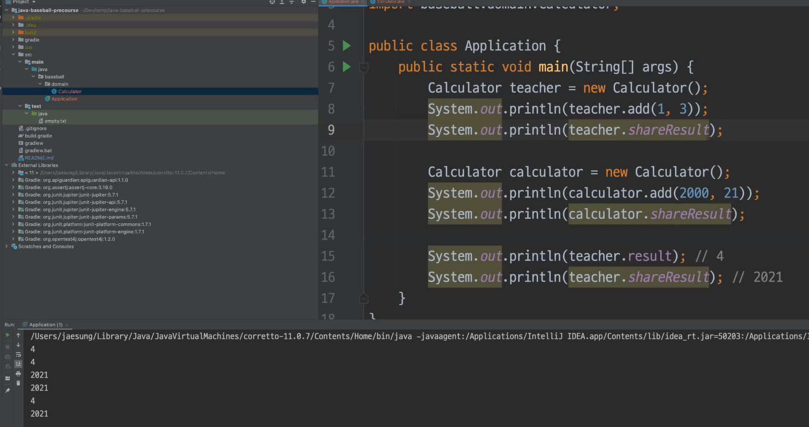
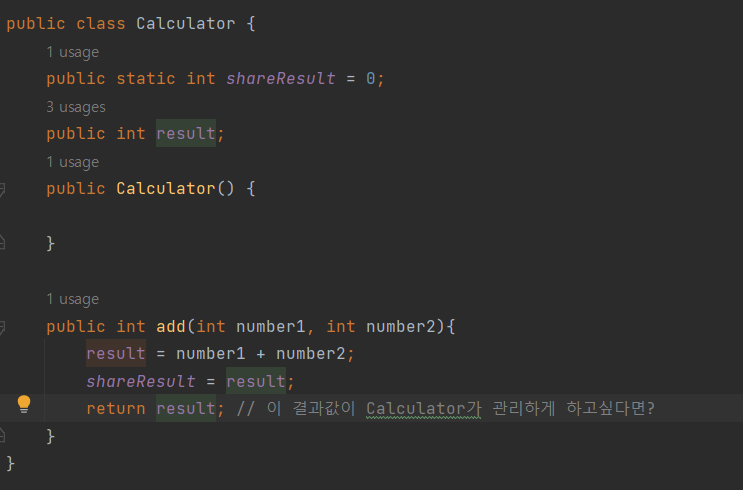

## 기능 목록
- [x] 1부터 9까지의 서로 다른 임의의 수 3개 생성 - NumberGenerator#**createRandomNumbers()**
- [ ] 컴퓨터의 숙와 플레이어의 수(3자리)를 비교할 수 있어야 한다. - Referee#**compare()**
  - [x] 몇 개의 수가 같은지를 알 수 있다. - Judgement#**correctCount()**
  - [ ] 특정 자리에 특정 숫자가 있는지 알 수 있다. - Judgment#**hasPlace()**
    - [ ] 같은 수가 같은 자리에 있으면 스트라이크이다. 
    - [ ] 같은 수가 다른 자리에 있으면 볼이다.
    - [ ] 같은 수가 전혀 없으면 낫싱이다.

### 그 외 정리
- 파이썬엔 pip, node js에는 npm이 있는 것처럼
- 자바에도 external 라이브러리에 추가할 수 있음
- 메이븐과 빌드 도구 사용하면 프로젝트 뼈대를 잡아줌
- 패키지 : 관련있는 클래스 한 곳에 모으는 것

- package baseball;
- 이라고 코드 맨 상단에 작성
- 클래스는 자바에서 파일과 같은 것
- 생성자 alt insert 
- new 통해 생성자 사용 new Calculator();
- import 통해서 어디서 가져오는건지 명시
- 
- 

##
- private public 범위

코드 포맷팅
ctrl alt l